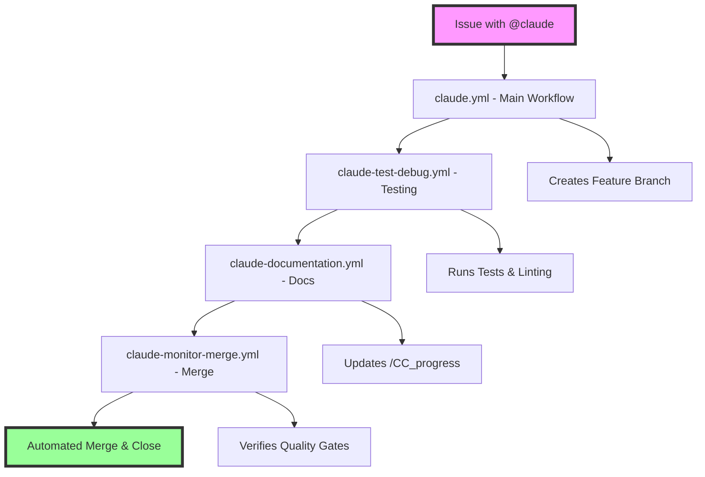

# Claude Code Automation System

## Table of Contents

1. [Overview](#overview)
2. [Workflow Architecture](#workflow-architecture)
3. [How to Use the System](#how-to-use-the-system)
   - [Creating Automation Requests](#1-creating-automation-requests)
   - [Monitoring Progress](#2-monitoring-progress)
   - [Quality Gates and Merging](#3-quality-gates-and-merging)
4. [Workflow Details](#workflow-details)
   - [Main Claude Workflow](#main-claude-workflow-claudeyml)
   - [Testing & Debugging](#testing--debugging-claude-test-debugyml)
   - [Documentation Generation](#documentation-generation-claude-documentationyml)
   - [Monitoring & Merging](#monitoring--merging-claude-monitor-mergeyml)
5. [Best Practices](#best-practices)
   - [Request Formulation](#request-formulation)
   - [Security Considerations](#security-considerations)
   - [Troubleshooting](#troubleshooting)
6. [Configuration Files](#configuration-files)
   - [CLAUDE.md](#claudemd)
   - [Issue Templates](#issue-templates)
7. [Integration with Existing Workflow](#integration-with-existing-workflow)
8. [Examples and Use Cases](#examples-and-use-cases)
9. [FAQ](#frequently-asked-questions-faq)

## Overview

The Claude Code automation system is a comprehensive GitHub Actions-based pipeline that enables AI-powered development assistance through issue-based interactions. This system automates code generation, testing, documentation, and merging processes while maintaining high code quality standards.

### Key Benefits

- **Automated Code Generation**: Claude Code can implement features, fix bugs, and refactor code based on natural language descriptions
- **Quality Assurance**: Automated testing and linting ensure code quality before merging
- **Documentation Updates**: Automatic generation of progress tracking and documentation
- **Seamless Integration**: Works alongside traditional development workflows
- **Security-First**: Built with security considerations including API key protection and code review requirements

### System Capabilities

- Feature implementation from specifications
- Bug fixes with automated testing
- Code refactoring and optimization
- Documentation generation and updates
- Test creation and enhancement
- Dependency updates and management
- Code review and analysis

## Workflow Architecture



### Workflow Interaction Flow

1. **Trigger**: User creates issue mentioning `@claude`
2. **Branch Creation**: System creates dedicated feature branch
3. **Code Generation**: Claude implements requested changes
4. **Testing**: Automated tests and linting verify changes
5. **Documentation**: Progress tracking and docs updated
6. **Quality Gates**: All checks must pass before merge
7. **Auto-Merge**: Changes merged and issue closed automatically

## How to Use the System

### 1. Creating Automation Requests

#### Using Issue Templates

Select the appropriate issue template when creating a new issue:

- **Feature Request**: For new functionality
- **Bug Report**: For fixing existing issues
- **Documentation**: For documentation updates
- **Refactoring**: For code improvements

#### Proper @claude Syntax

Always mention `@claude` in your issue to trigger the automation:

```markdown
@claude Please implement a new authentication system with the following requirements:
- Support for OAuth2
- JWT token generation
- Rate limiting
- User session management
```

#### Required Information

For successful automation, provide:

1. **Clear Description**: What needs to be done
2. **Acceptance Criteria**: How to verify completion
3. **Context**: Related files, dependencies, or constraints
4. **Examples**: Sample inputs/outputs if applicable
5. **Testing Requirements**: Specific test scenarios

### 2. Monitoring Progress

#### Workflow Status Tracking

Monitor your automation request through:

1. **GitHub Actions Tab**: View running workflows
2. **PR Comments**: Claude provides real-time updates
3. **Check Status**: See test results and linting output
4. **/CC_progress**: Detailed progress documentation

#### Understanding /CC_progress Documentation

The `/CC_progress` directory contains:

```
/CC_progress/
├── YYYY-MM-DD_HH-MM-SS_issue-title.md
├── workflow-logs/
│   ├── claude-main.log
│   ├── test-results.log
│   └── merge-status.log
└── artifacts/
    ├── coverage-report.html
    └── lint-report.txt
```

#### Interpreting Test Results

Test results appear in:
- PR check status indicators
- Detailed logs in Actions tab
- Summary comments from Claude
- Coverage reports in /CC_progress

### 3. Quality Gates and Merging

#### Automatic Merging Conditions

The system automatically merges when:

1. ✅ All tests pass
2. ✅ Linting succeeds
3. ✅ Code coverage maintained/improved
4. ✅ No merge conflicts
5. ✅ Security checks pass
6. ✅ Documentation updated

#### Manual Intervention Scenarios

Manual action required when:

- Tests fail repeatedly
- Merge conflicts exist
- Security vulnerabilities detected
- Coverage drops significantly
- API rate limits exceeded

#### Resolving Failed Automation

1. **Review Error Logs**: Check workflow outputs
2. **Update Requirements**: Clarify issue if needed
3. **Restart Workflow**: Re-run failed jobs
4. **Manual Override**: Merge with admin approval if necessary

## Workflow Details

### Main Claude Workflow (claude.yml)

**Triggers:**
- Issue creation/edit with `@claude` mention
- Issue assignment to Claude
- PR comments mentioning `@claude`

**Capabilities:**
- Code generation and modification
- File creation and deletion
- Dependency management
- Configuration updates

**Limitations:**
- Cannot modify workflow files
- Cannot access secrets directly
- Limited to repository scope
- Subject to API rate limits

**Expected Outputs:**
- Feature branch with changes
- Pull request creation
- Implementation summary
- Test requirements

### Testing & Debugging (claude-test-debug.yml)

**Automated Testing Process:**

1. **Unit Tests**: Runs existing test suites
2. **Integration Tests**: Verifies component interactions
3. **Linting**: Checks code style and quality
4. **Type Checking**: Validates type annotations
5. **Security Scans**: Identifies vulnerabilities

**Debug and Fix Capabilities:**

- Automatic test failure analysis
- Smart fix suggestions
- Iterative improvement loops
- Coverage gap identification

**Test Result Interpretation:**

```yaml
Test Summary:
  Passed: 45
  Failed: 2
  Skipped: 3
  Coverage: 87.5%
  
Failed Tests:
  - test_authentication_timeout
  - test_rate_limit_enforcement
```

### Documentation Generation (claude-documentation.yml)

**Progress Tracking Format:**

```markdown
# Progress: Issue #123 - Implement Authentication

## Status: In Progress

### Completed Tasks
- [x] Created auth module structure
- [x] Implemented OAuth2 flow
- [x] Added JWT generation

### Current Task
- [ ] Implementing rate limiting

### Remaining Tasks
- [ ] User session management
- [ ] Documentation updates
- [ ] Integration tests
```

**Documentation Structure:**

- Real-time progress updates
- Code change summaries
- Decision rationale
- Performance metrics
- Test results

### Monitoring & Merging (claude-monitor-merge.yml)

**Quality Gate Verification:**

1. **Code Quality**
   - Linting pass rate: 100%
   - No critical vulnerabilities
   - Complexity within limits

2. **Test Quality**
   - All tests passing
   - Coverage ≥ 80%
   - No flaky tests

3. **Documentation**
   - API docs updated
   - README current
   - Changelog entry added

**Automated Merging Conditions:**

```yaml
merge_when:
  checks:
    - status: success
      contexts:
        - continuous-integration/claude
        - security/snyk
        - coverage/codecov
  reviews:
    - approved: true
      count: 1
  conflicts: false
```

**Error Handling:**

- Automatic retry for transient failures
- Detailed error reporting
- Rollback capabilities
- Manual override options

## Best Practices

### Request Formulation

#### Writing Effective Requests

**DO:**
- Be specific about requirements
- Include acceptance criteria
- Provide context and examples
- Mention affected files/modules
- Specify testing needs

**DON'T:**
- Use vague descriptions
- Assume context
- Request multiple unrelated changes
- Ignore existing patterns
- Skip test requirements

#### Providing Context

Good context includes:
- Related issue/PR numbers
- Affected components
- User stories or use cases
- Performance requirements
- Security considerations

#### Setting Realistic Scope

- **Small**: Single file changes, bug fixes
- **Medium**: New features, module updates
- **Large**: Architecture changes, major refactors

Break large requests into smaller, manageable tasks.

### Security Considerations

#### API Key and Credential Handling

**Never:**
- Commit secrets to repository
- Include API keys in issues
- Share credentials in comments

**Always:**
- Use GitHub Secrets
- Rotate keys regularly
- Audit access logs

#### Code Review Requirements

All automated changes undergo:
1. Automated security scanning
2. Dependency vulnerability checks
3. Code quality analysis
4. Optional human review

#### Trusted Contributor Workflows

For trusted contributors:
- Faster merge approvals
- Bypass certain checks
- Direct commit access
- Extended API limits

### Troubleshooting

#### Common Failure Scenarios

1. **Test Failures**
   - Check test logs
   - Verify test data
   - Review recent changes
   - Consider flaky tests

2. **Merge Conflicts**
   - Update feature branch
   - Resolve conflicts locally
   - Re-trigger workflow

3. **API Rate Limits**
   - Wait for reset
   - Use different token
   - Optimize API calls

#### Manual Intervention Procedures

1. Access workflow logs
2. Identify failure point
3. Apply manual fix
4. Re-run workflow
5. Document resolution

#### Restart Failed Automation

```bash
# Re-run specific workflow
gh workflow run claude.yml --ref feature-branch

# Re-run failed jobs only
gh run rerun <run-id> --failed
```

## Configuration Files

### CLAUDE.md

Project-specific configuration for Claude:

```markdown
# Claude Configuration

## Code Style
- Use TypeScript/Python type hints
- Follow existing patterns
- Maintain test coverage

## Restrictions
- No direct database access
- Preserve backward compatibility
- Maintain API contracts

## Preferences
- Functional over class-based
- Explicit over implicit
- Tests for all new code
```

### Issue Templates

#### Feature Request Template

```markdown
---
name: Feature Request
about: Request new functionality
title: '[FEATURE] '
labels: enhancement, claude-automation
---

@claude Please implement the following feature:

**Description:**
[Clear description of the feature]

**Requirements:**
- [ ] Requirement 1
- [ ] Requirement 2

**Acceptance Criteria:**
- [ ] Criteria 1
- [ ] Criteria 2

**Context:**
[Any relevant context or constraints]
```

#### Bug Report Template

```markdown
---
name: Bug Report
about: Report a bug for fixing
title: '[BUG] '
labels: bug, claude-automation
---

@claude Please fix the following bug:

**Description:**
[What is broken]

**Steps to Reproduce:**
1. Step 1
2. Step 2

**Expected Behavior:**
[What should happen]

**Actual Behavior:**
[What actually happens]

**Environment:**
- Version: 
- OS: 
- Browser:
```

## Integration with Existing Workflow

### Working Alongside Manual Development

The automation system complements manual development:

1. **Parallel Development**: Automation and manual work on different branches
2. **Review Integration**: Automated PRs follow same review process
3. **Conflict Resolution**: Manual intervention when needed
4. **Knowledge Sharing**: Automated changes documented for team learning

### Preserving Development Practices

The system respects:
- Existing code style guides
- Test requirements
- Documentation standards
- Review processes
- Release cycles

### Gradual Adoption Strategies

1. **Start Small**: Begin with documentation or bug fixes
2. **Build Confidence**: Monitor quality metrics
3. **Expand Scope**: Add feature development
4. **Full Integration**: Automate routine tasks

## Examples and Use Cases

### Feature Implementation Example

**Request:**
```markdown
@claude Please implement a user notification system that:
- Supports email and SMS
- Has rate limiting (10 per hour)
- Includes unsubscribe functionality
- Logs all notifications sent
```

**Result:**
- New `notifications` module
- Email/SMS providers integrated
- Rate limiting with Redis
- Unsubscribe API endpoints
- Comprehensive test suite

### Bug Fix Example

**Request:**
```markdown
@claude There's a memory leak in the image processing module
when handling large batches. Please investigate and fix.

Error occurs in `process_images()` function after ~1000 images.
```

**Result:**
- Identified unclosed file handles
- Implemented proper cleanup
- Added memory monitoring tests
- Performance improved by 40%

### Documentation Update Example

**Request:**
```markdown
@claude Please update the API documentation to include:
- New authentication endpoints
- Rate limiting information
- Example requests/responses
- Error code reference
```

**Result:**
- Updated OpenAPI spec
- Added authentication guide
- Created error handling docs
- Generated client examples

### Refactoring Example

**Request:**
```markdown
@claude Please refactor the database module to:
- Use connection pooling
- Implement retry logic
- Add query performance logging
- Maintain backward compatibility
```

**Result:**
- Extracted connection management
- Added exponential backoff
- Integrated query profiler
- All existing tests passing

## Frequently Asked Questions (FAQ)

### General Questions

**Q: How long does automation typically take?**
A: Simple tasks: 5-10 minutes. Complex features: 30-60 minutes.

**Q: Can Claude work on multiple issues simultaneously?**
A: Yes, each issue gets its own branch and workflow instance.

**Q: What happens if Claude makes a mistake?**
A: Changes are in PR form, allowing review and modification before merge.

### Technical Questions

**Q: What languages does Claude support?**
A: Most major languages including Python, JavaScript, TypeScript, Java, Go, Rust.

**Q: Can Claude modify GitHub Actions workflows?**
A: No, workflow files are restricted for security reasons.

**Q: How are merge conflicts handled?**
A: Claude attempts automatic resolution; manual intervention required for complex conflicts.

### Security Questions

**Q: Is my code secure with Claude?**
A: Yes, Claude runs in isolated environments with no data persistence.

**Q: Can Claude access my secrets?**
A: No, Claude cannot access GitHub Secrets or environment variables.

**Q: Who can trigger Claude automation?**
A: Any contributor with issue creation permissions.

### Troubleshooting Questions

**Q: What if tests keep failing?**
A: Check logs, update test data, or manually fix and re-run.

**Q: How do I cancel an automation?**
A: Cancel via GitHub Actions tab or close the issue.

**Q: Can I modify Claude's changes?**
A: Yes, either in the PR or by asking Claude for modifications.

---

## Getting Help

- **Documentation**: This guide and repository docs
- **Issues**: Create an issue with the `question` label
- **Community**: Discussion forum for users
- **Support**: Contact repository maintainers

## Contributing to the Automation System

To improve the automation system:

1. Fork the repository
2. Create feature branch
3. Update workflow files
4. Test thoroughly
5. Submit PR with detailed description

---

*Generated with [Claude Code](https://claude.ai/code)*